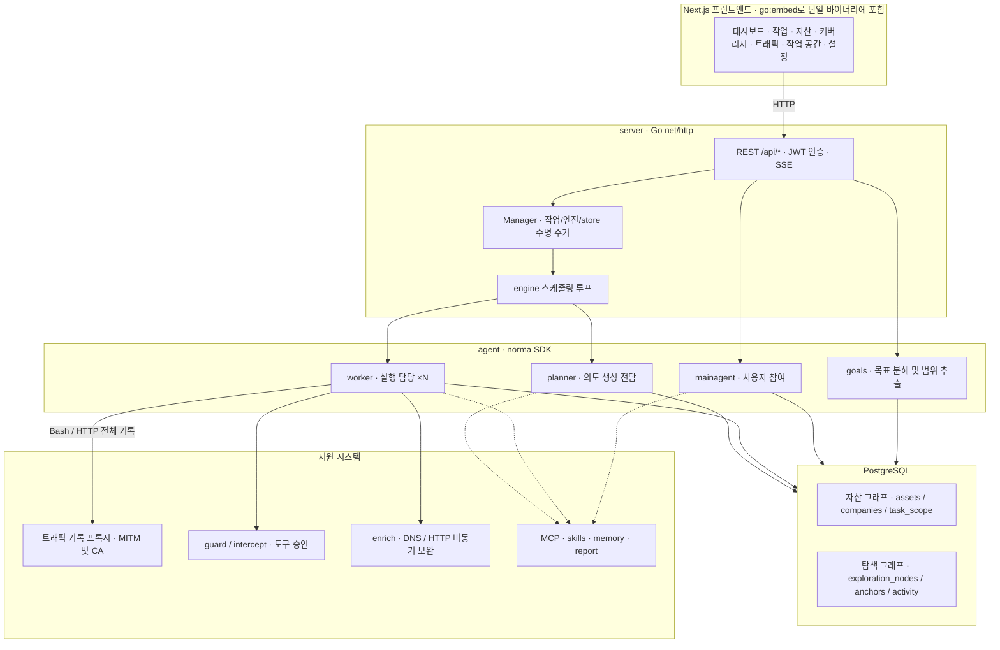
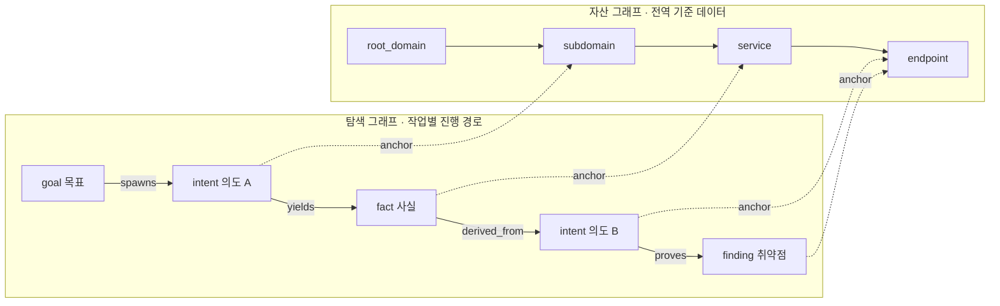
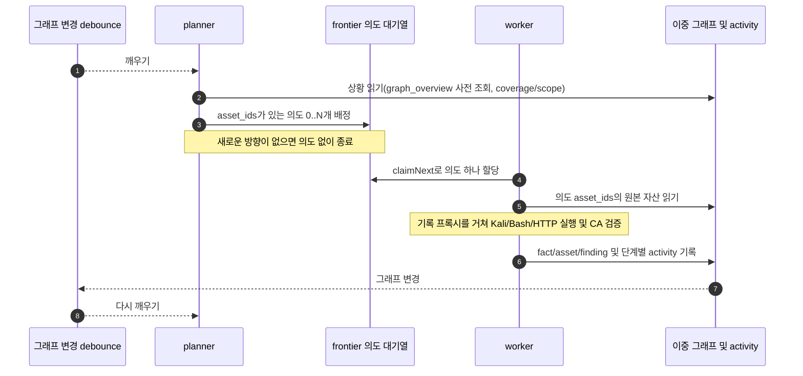
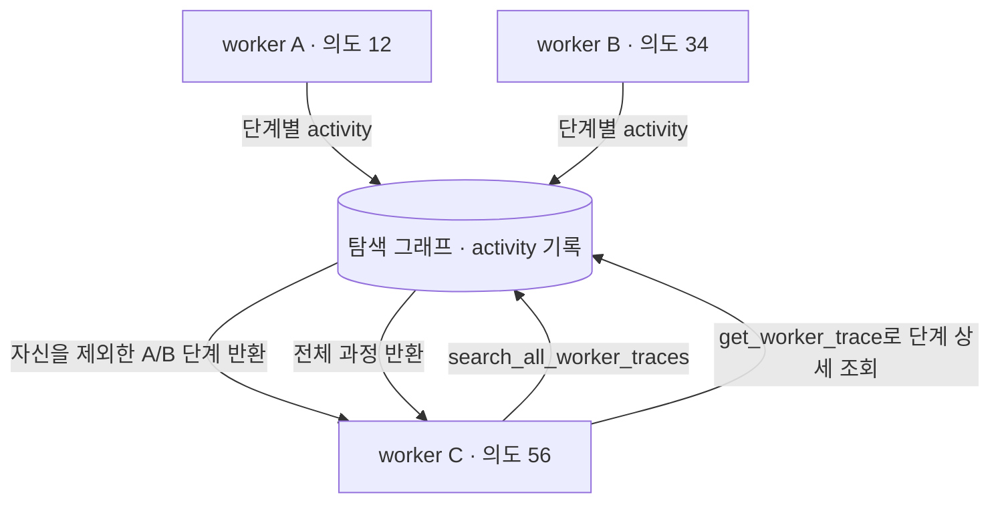
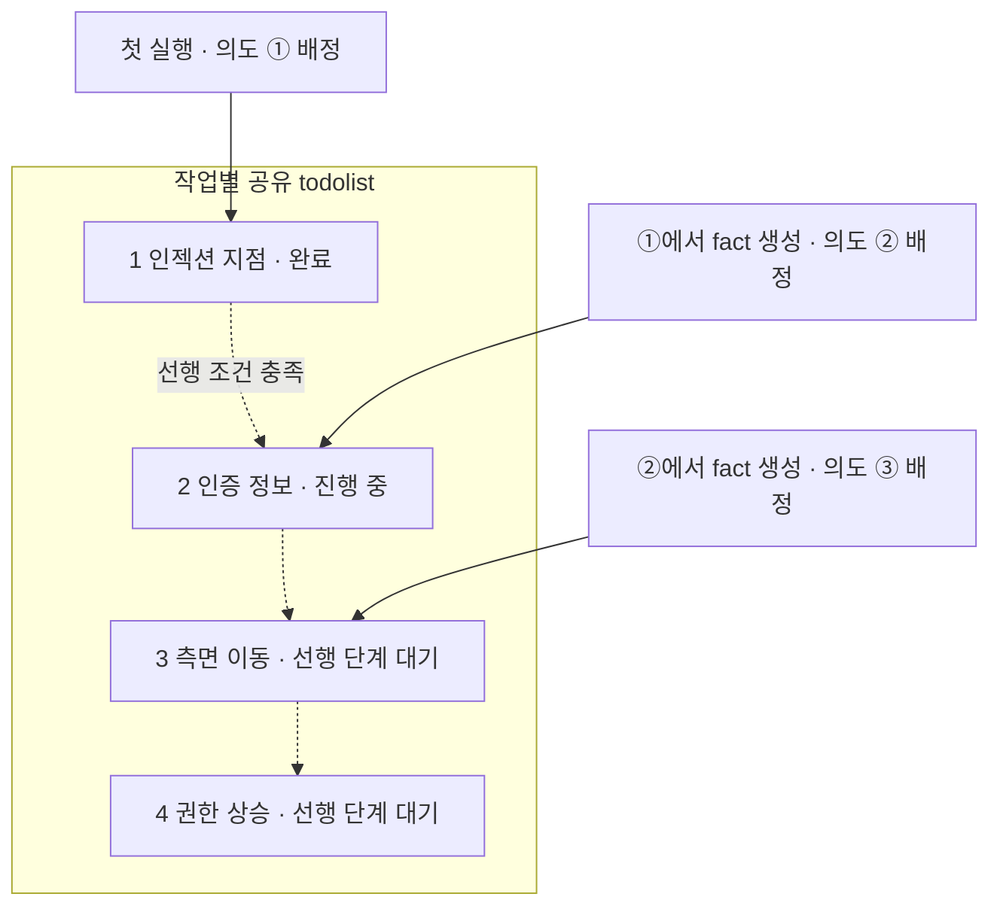

<div align="center">

# ARTEX

AI 자율 침투 테스트 시스템(Go 백엔드 + Next.js 프런트엔드)

🌐 **온라인 데모**: [https://artex-demo.vercel.app/](https://artex-demo.vercel.app/)

</div>

---

## 한국어 번역 범위

웹 화면, 문서, 소스 주석, 서버 오류·알림, 기본 에이전트 프롬프트와 도구 설명을 한국어로 제공합니다. 기존 DB에 저장된 대화·보고서·사용자 지정 프롬프트는 자동 번역하거나 덮어쓰지 않습니다. 업그레이드 후 저장된 기본 프롬프트가 이전 언어로 남아 있다면 에이전트 설정에서 변경 내용을 확인하고 기본값으로 복원할 수 있습니다.

호환성을 위해 기존 멘션 토큰과 판정 결과의 비교값, 외부 서비스의 오류 감지 패턴, ICP 등록 번호, 다국어 인코딩 테스트 데이터, 원본 검증 기록과 문서 파일명은 유지합니다. 아래 스크린샷과 링크된 온라인 데모는 원본 프로젝트 자료입니다.

## 화면 미리보기

> 전체 상호작용은 [원본 온라인 데모](https://artex-demo.vercel.app/)에서 확인할 수 있습니다. 아래 이미지는 원본 프로젝트의 화면입니다.

| 대시보드(개요 / 토큰 사용량 / 활동 피드) | 작업 목록 |
| :---: | :---: |
|  |  |

| 작업 실행 과정(세션 / 도구 호출) | 탐색 경로 |
| :---: | :---: |
|  |  |

| 발견 사항 | 자산 |
| :---: | :---: |
|  |  |

| 자산 커버리지 그래프(힘 기반 배치 · 테스트 완료 강조 · 노드 접기/펼치기) |
| :---: |
|  |

| 트래픽 기록 | 사람이 참여하는 대화 |
| :---: | :---: |
|  |  |

| 에이전트 관리 | LLM 설정 |
| :---: | :---: |
|  |  |

| 차단 승인 | 백엔드 로그 |
| :---: | :---: |
|  |  |

---

## 승인 기록 상세

전역의 「승인 기록」, 작업 내부의 「차단 승인」 및 대화의 승인 카드에서 항목을 펼쳐 상세 정보를 확인할 수 있습니다. 표시 구조는 [AegisHook의 승인 상세 컴포넌트](https://github.com/RuoJi6/AegisHook/blob/main/web/src/components/CallDetail.vue)를 참고하며 ARTEX의 컴포넌트와 테마를 사용합니다.

## 자산 동기화(ScopeSentry)

[ScopeSentry](https://github.com/Autumn-27/ScopeSentry)에서 자산 데이터를 직접 동기화하여 중복 수집을 줄일 수 있습니다.

- **자산 동기화** 페이지에서 ScopeSentry 주소와 API 키를 입력하여 데이터 소스를 연결합니다.
- **프로젝트** 또는 **작업**을 기준으로 동기화할 대상과 자산 유형(도메인 / 하위 도메인 / IP / 포트 / 사이트 / 엔드포인트 등)을 선택합니다.
- 한 번에 가져온 뒤 기업 자산 범위에 따라 통합합니다. 자산은 ARTEX 자산 그래프에 들어가 에이전트의 탐색에 사용됩니다.

---

## 설치

> **PostgreSQL**이 필요합니다. 탐색에는 **LLM** 설정이 필요하며 `ANTHROPIC_API_KEY` 또는 `OPENAI_API_KEY`를 사용하거나 UI에서 설정할 수 있습니다.
>
> 이 포크의 한국어 화면은 **소스 빌드**로 사용할 수 있습니다. 원본 프로젝트의 Docker 이미지, 릴리스 및 온라인 데모에는 이 포크의 번역이 포함되지 않습니다.

### 방법 1: 설치 스크립트

```bash
git clone https://github.com/namsh1125/ARTEX.git
cd ARTEX
./install.sh
```

스크립트는 Docker를 확인하고 필요하면 설치한 다음 **① 전체 Docker 실행** 또는 **② 로컬 빌드 실행**을 선택하게 합니다.

- **① 전체 Docker 실행**: Postgres 비밀번호 입력(Enter로 무작위 생성 가능) → `.env` 자동 생성 → `docker compose up -d`. 원본 이미지를 사용합니다.
- **② 로컬 실행**: 데이터베이스 선택(기존 연결 / Docker로 생성) → `config.json` 생성 → 프런트엔드를 포함한 단일 Go 바이너리 빌드 → 실행. 이 포크의 번역을 사용하려면 소스 빌드를 선택하세요.

설치 후 **http://localhost:8787**에 접속합니다. 처음에는 `/setup`에서 관리자 비밀번호를 설정합니다.

### 방법 2: Docker Compose(수동)

```bash
git clone https://github.com/namsh1125/ARTEX.git
cd ARTEX
cp .env.example .env          # POSTGRES_PASSWORD 및 선택적으로 ANTHROPIC_API_KEY 입력
docker compose up -d          # 원본 autumn27/artex 이미지와 postgres 실행
# → http://localhost:8787
```

이미지에는 ripgrep, curl, vim, npm, nmap 등의 도구가 포함됩니다. `./skills`와 `./data`는 바인드 마운트로 영구 저장합니다.

원격 MCP는 시스템 설정에서 `http`(Streamable HTTP) 또는 `sse`(이전 SSE 방식)를 선택할 수 있습니다. 이전 SSE 서비스는 보통 `GET /sse`로 이벤트 스트림을 만들고 서버가 반환한 `/message?sessionId=...`로 JSON-RPC 요청을 받습니다. URL에는 `/sse` 주소를 입력하고 요청 헤더는 `Authorization=Bearer <token>` 형식으로 지정합니다.

### 방법 3: 사전 빌드 바이너리 다운로드(Releases)

[원본 Releases](https://github.com/Autumn-27/ARTEX/releases)에서 플랫폼에 맞는 zip을 다운로드합니다. 압축을 풀면 `artex`, `start.sh`(Windows는 `start.bat`), `skills/`, `config.example.json`이 있습니다. 원본 릴리스에는 이 포크의 번역이 포함되지 않습니다.

```bash
cp config.example.json config.json   # database 연결 정보 입력
./start.sh                           # → http://localhost:8787
```

> `./artex`를 직접 실행하지 말고 `start.sh` 또는 `start.bat`을 사용하세요. 이 감시 스크립트는 종료 코드에 따라 프로그램을 다시 실행합니다. **[페이지에서 업데이트](#방법-1-페이지에서-업데이트)** 기능도 이 스크립트를 통해 새 바이너리로 교체합니다. 직접 실행하면 업데이트 후 자동으로 다시 시작하지 않습니다.
> 백그라운드 실행: `nohup ./start.sh >artex.log 2>&1 &`.

### 방법 4: 소스에서 단일 바이너리 빌드

```bash
# 1) 프런트엔드 정적 내보내기
cd web && npm ci && npm run build:static && cd ..
# 2) 임베드 디렉터리에 복사
cp -r web/out server/webui/dist
# 3) 빌드(-tags embedui를 지정해야 프런트엔드 포함)
CGO_ENABLED=0 go build -tags embedui -o artex ./cmd/artex
./start.sh
```

### 방법 5: 여러 플랫폼의 릴리스 압축 파일 빌드

`build.sh`는 프런트엔드를 빌드·포함하고 Go 링커로 디버그 정보를 제거한 뒤 배포 파일을 zip으로 압축합니다. Release 모드는 기본적으로 Linux amd64/arm64, macOS amd64/arm64, Windows amd64 파일을 만듭니다.

```bash
./build.sh --release
# 산출물: dist/artex-0.3.3-*.zip
```

UPX 자체 압축 해제 바이너리는 일부 Linux 커널, 가상화 환경 또는 보안 정책과 호환되지 않을 수 있어 기본적으로 사용하지 않습니다. `ARTEX_TARGETS`로 대상 플랫폼을 지정할 수 있으며 실행 환경과의 호환성을 확인했다면 `--upx`로 바이너리 크기를 줄일 수 있습니다.

```bash
ARTEX_TARGETS=linux/amd64,windows/amd64 ./build.sh --release
./build.sh --target linux/amd64 --upx
```

---

## 업데이트

> 업그레이드는 프로그램을 교체하고 데이터를 유지합니다. Postgres 볼륨 `pgdata`, `./data`(jwt.key / SQLite 등), `./skills`가 보존됩니다. **데이터베이스 마이그레이션을 수동으로 실행할 필요가 없습니다.** 시작할 때마다 `schema.sql`을 멱등하게 실행하며 `ADD COLUMN`, `CREATE INDEX IF NOT EXISTS` 등을 포함합니다. 즉 재시작 시 마이그레이션합니다. 그래도 업그레이드 전 `./data`와 데이터베이스를 백업하는 것이 좋습니다.
>
> 원본 릴리스로 업데이트하면 한국어로 빌드한 바이너리가 원본 버전으로 교체될 수 있습니다. 번역을 유지하려면 이 포크의 소스에서 다시 빌드하세요.

### 방법 1: 페이지에서 업데이트

**시스템 설정**(`/system/settings`)의 **버전 및 업데이트** 카드에서 서버에 로그인하지 않고 새 버전을 확인하고 설치할 수 있습니다.

「업데이트」를 누르면 현재 플랫폼의 릴리스 다운로드 → `SHA256SUMS` 비교 → 새 바이너리의 `-h` 스모크 테스트 → `artex.new`로 임시 저장 → 프로그램 종료 순서로 진행합니다. `start.sh` 또는 `start.bat`이 다시 실행하면서 교체를 완료하고, 페이지는 새 버전이 시작되면 자동으로 새로 고칩니다.

- **실패한 프로그램으로 교체하지 않습니다.** 검증이나 스모크 테스트 실패 시 임시 파일을 버리고 현재 버전을 유지합니다. 교체 후 새 버전이 세 번 연속 시작에 실패하면 `artex.old`로 자동 롤백하며 실패한 파일은 조사용 `artex.failed`로 남깁니다.
- **이전 버전으로 돌아갈 수 있습니다.** `artex.old`를 유지하며 카드에서 「이전 버전으로 롤백」을 선택할 수 있습니다. 데이터베이스 구조는 되돌리지 않습니다.
- **업데이트는 재시작을 수반하여 실행 중인 작업을 중단합니다.** 작업이 없을 때 진행하세요.
- **개발 빌드는 업데이트를 비활성화합니다.** 버전이 `dev`이거나 `git describe` 접미사를 포함하면 공식 바이너리가 로컬 디버그 빌드를 덮어쓰지 않도록 제한합니다.
- **Docker 내부 업데이트는 프로그램만 바꿉니다.** playwright, nmap 등 이미지의 도구는 갱신되지 않습니다. `docker compose up -d`로 컨테이너를 다시 만들면 이미지 버전으로 돌아갑니다. 이미지까지 갱신하려면 `docker compose pull artex && docker compose up -d artex`를 실행합니다.
- GitHub 접속에 프록시가 필요하면 같은 페이지의 **전역 프록시**를 설정합니다. 업데이트는 GitHub 도메인에서 HTTPS로만 다운로드합니다.

### 방법 2: 업데이트 스크립트

```bash
cd ARTEX
./update.sh
```

선택적으로 `git pull`을 실행한 후 `install.sh`와 마찬가지로 **① Docker 업데이트** 또는 **② 로컬 빌드 업데이트**를 선택합니다.

- **① Docker**: 이미지 태그 지정(Enter를 누르면 `.env`의 `ARTEX_TAG`, 없으면 `latest`) → `docker compose pull` → `docker compose up -d`. 새 이미지로 재시작하면서 자동 마이그레이션합니다.
- **② 로컬**: 프런트엔드 정적 산출물 재생성 → `./artex` 재빌드. 이후 프로세스를 재시작하여 적용합니다.

### 방법 3: Docker Compose(수동)

```bash
cd ARTEX
git pull                       # compose 및 스크립트 갱신(선택)
# 버전 지정: .env에서 ARTEX_TAG=v0.2.0 설정. 생략하면 latest
docker compose pull artex
docker compose up -d artex     # 새 이미지로 재시작하고 schema 자동 마이그레이션
docker image prune -f          # 이전 이미지 정리(선택)
```

### 방법 4: 사전 빌드 바이너리(Releases)

[원본 Releases](https://github.com/Autumn-27/ARTEX/releases)에서 새 zip을 다운로드하고 기존 프로세스를 종료한 뒤 `artex`와 `skills/`를 교체합니다. `config.json`과 `data/`는 유지하고 다시 시작합니다.

```bash
cp -r <압축해제디렉터리>/skills ./ && cp <압축해제디렉터리>/artex ./
./start.sh
```

### 방법 5: 소스 빌드

```bash
git pull
cd web && npm ci && npm run build:static && cd ..
cp -r web/out server/webui/dist
CGO_ENABLED=0 go build -tags embedui -o artex ./cmd/artex
# ./start.sh 재시작
```

---

## 설정

**데이터베이스**: `config.json`에 지정하거나 `ARTEX_PG_DSN` 환경 변수로 재정의합니다.

```json
{
  "database": {
    "host": "127.0.0.1", "port": 5432,
    "user": "artex", "password": "yourpass",
    "dbname": "artex", "sslmode": "disable"
  }
}
```

**LLM**: `export ANTHROPIC_API_KEY=sk-...` 또는 `OPENAI_API_KEY`를 설정하거나 UI의 「LLM 설정」에 입력합니다. 선택 변수는 `ARTEX_LLM_PROVIDER`, `ARTEX_LLM_MODEL`, `ARTEX_LLM_BASE_URL`, `ARTEX_LLM_PROXY`입니다.

**동시 실행**: 작업당 실행 에이전트 수는 「시스템 설정」에서 지정하며 기본값은 3입니다.

**주요 인수**: `./start.sh -addr :8787 -proxy :8788`. `-addr`는 프런트엔드와 API, `-proxy`는 트래픽 기록 프록시입니다. 실행 스크립트는 인수를 `artex`에 그대로 전달합니다.

### 리버스 프록시 배포(HTTPS / 443만 공개)

프런트엔드와 API/SSE는 동일한 백엔드 포트(기본 `:8787`)에서 제공됩니다. 실시간 활동 피드는 기본적으로 **동일 출처**를 사용하므로 **`NEXT_PUBLIC_SSE_BASE`를 설정할 필요가 없습니다.** 외부에는 443만 열고 8787은 내부망에 둘 수 있습니다.

SSE는 장기 연결로 계속 데이터를 보내므로 **리버스 프록시의 버퍼링을 꺼야 합니다.** 그렇지 않으면 연결은 되지만 이벤트를 받지 못해 활동 피드가 계속 로딩 상태로 남습니다. Nginx 예시:

```nginx
server {
    listen 443 ssl;
    server_name your.domain.com;
    # ssl_certificate / ssl_certificate_key ...

    location / {
        proxy_pass http://127.0.0.1:8787;
        proxy_set_header Host $host;
        proxy_set_header X-Forwarded-Proto $scheme;

        # SSE: 버퍼링 해제, 긴 시간 제한, HTTP/1.1
        proxy_buffering off;
        proxy_cache off;
        proxy_read_timeout 3600s;
        proxy_http_version 1.1;
        proxy_set_header Connection "";
    }
}
```

> 별도 하위 도메인 등 페이지와 다른 출처에서 SSE를 제공할 때만 **빌드 시점**에 `NEXT_PUBLIC_SSE_BASE`를 설정합니다. 이 값은 `next build` 때 정적 파일에 포함되므로 컨테이너 실행 시 설정해도 적용되지 않습니다.

---

## 개발

### 수동 취약점 재검증

작업 상세의 「재검증」 탭에서 해당 작업의 취약점을 페이지별로 선택하고 과거 결론과 증거를 보거나 수동 재검증을 시작할 수 있습니다. 실행 후 현재 탭을 유지하며 진행 아이콘과 「재검증 중」을 표시합니다. 수정이 확인되면 취약점 상태를 갱신합니다.

취약점 목록 행의 「재검증」 또는 상세의 「취약점 재검증 → 재검증 시작」을 선택하고 수정 버전, 테스트 조건 또는 제약을 선택적으로 입력하면 독립적인 재검증 에이전트 세션을 만듭니다. 실행 후 현재 페이지를 유지합니다. 목록, 작업별 그룹 및 자산 보기에서 모두 사용할 수 있습니다. 실행 중 「재검증 중」을 클릭하면 세션으로 이동하고 완료되면 「재검증」으로 돌아옵니다. 원래 스캔 작업을 다시 시작할 필요가 없습니다. 결론은 「여전히 재현됨」, 「수정됨」, 「확인 불가」로 구분하며 결론, 증거 및 세션 링크를 상세에 저장합니다.

새 백엔드는 처음 시작할 때 편집 가능한 「취약점 재검증」(`retester`) 에이전트를 등록합니다. 에이전트 관리에서 프롬프트, LLM, 실행 예산 및 도구를 설정할 수 있습니다. 연결된 LLM을 우선 사용하고 없으면 전역 활성 설정을 사용합니다. 세션이 성공적으로 끝나고 결론이 「수정됨」이면 처리 상태를 자동으로 변경합니다. 실행 중, 실패, 중지 또는 다른 결론일 때는 기존 상태를 유지합니다. 원본 증거와 보고서는 항상 보존하며 상태 메뉴에서 직접 「수정됨」을 선택할 수도 있습니다. 같은 취약점을 재검증 중이면 기존 세션을 재사용하고, 중지·실패·서버 재시작 후에는 다시 시작할 수 있습니다.

현재 재검증 이력은 취약점 상세와 세션에서 확인합니다. 보고서 내보내기와 작업 보관 파일에는 아직 포함하지 않으며 트래픽 패킷도 자동 연결하지 않습니다. 데모 모드는 모의 기록임을 명시하고 실제 대상에 요청하지 않습니다.

### 로컬 실행 및 테스트

```bash
./dev.sh    # 백엔드(:8787) + 트래픽 프록시(:8788) + next dev(:5173) → http://localhost:5173
```

- 백엔드: `go run ./cmd/artex`. `-tags embedui`가 없으면 프런트엔드를 포함하지 않습니다.
- 프런트엔드: `cd web && npm run dev`. `/api`를 백엔드로 프록시하며 핫 리로드를 지원합니다.
- 테스트: `go test ./...`.
- 백엔드 없는 데모: `cd web && NEXT_PUBLIC_MOCK=1 npm run dev`.

---

## 시스템 아키텍처

ARTEX는 **LLM 기반 다중 에이전트 자율 침투 시스템**입니다. Next.js 프런트엔드를 포함하는 Go 단일 백엔드와 PostgreSQL로 구성됩니다. 에이전트 기능은 [`norma`](https://github.com/Autumn-27/norma) SDK의 `agentcore`, `tool`, `permission`, `harness`, `memory`, `transcript`에서 제공합니다. 핵심은 **이중 그래프 구조**, **worker 간 실행 과정 공유**, **planner의 여러 실행에 걸친 공유 할 일 목록(todolist)**입니다.

### 전체 계층



| 계층 | 역할 |
| --- | --- |
| **프런트엔드** | Next.js 정적 내보내기 및 `go:embed` 포함. 작업, 자산, 탐색 경로와 커버리지 시각화 및 사용자 참여 대화 |
| **server** | `net/http` 라우팅, JWT 인증, SSE. `Manager`가 작업·엔진·DB store 수명 주기 관리 |
| **engine** | 작업마다 `plannerLoop` 하나와 N개 worker goroutine. 의도 할당, 시간 제한, 일시 중지 및 drain 처리 |
| **agent** | goals / planner / worker / mainagent. `ToolSet`으로 두 그래프를 LLM 도구에 노출 |
| **db** | pgx를 통한 PostgreSQL 저장. `go:embed`한 스키마를 매 시작 시 멱등하게 적용 |
| **지원** | 기록용 MITM 프록시, 승인 제어, 비동기 보완, MCP, 스킬, 메모리 및 보고서 |

### 이중 그래프: 탐색 그래프와 자산 그래프

**대상이 무엇인지**와 **어디까지 테스트했는지**를 독립적인 두 그래프로 나누고 앵커로 연결합니다.

- **자산 그래프(Asset Graph, 전역 공유)**: 작업 간 공유하는 자산의 기준 데이터입니다. `root_domain / subdomain / ip / service / app / endpoint` 노드를 기업에 연결합니다. 도메인 → 하위 도메인 → 서비스 → 엔드포인트의 부모·자식 관계와 중복 제거 키는 프로그램이 계산하며 에이전트는 원본 정보만 제출합니다.
- **탐색 그래프(Exploration Graph, 작업별 독립)**: 작업의 사고 및 진행 과정을 표현합니다. `goal`(목표), `intent`(의도), `fact`(사실), `finding`(취약점), `hint`(힌트)를 `spawns / derived_from / yields / proves` 등의 간선으로 연결하여 어떤 사실에서 방향이 나왔고 무엇을 생성했는지 추적합니다.
- **앵커 연결**: `exploration_anchors(node_id, asset_id)`로 의도·사실·취약점을 자산에 연결합니다. 탐색 방향에서 대상 자산을 보거나, 특정 자산에서 테스트한 의도와 확인한 사실을 역조회할 수 있습니다. 자산 테스트 커버리지와 범위 내 자산의 테스트 완료 강조에도 사용합니다.



> **planner**는 탐색 그래프와 목표를 확인하고 아직 다루지 않은 새로운 방향이 있을 때만 의도를 frontier에 추가합니다. **worker**는 의도 하나를 할당받아 도구로 실행하고 새 자산·사실·취약점을 두 그래프에 기록한 뒤 종료합니다. 자산 그래프는 공유 사실이며 탐색 그래프는 작업별 진행 경로입니다.

### 엔진과 의도의 수명 주기

엔진은 **이벤트 기반 순환 구조**입니다. 그래프 변경 → planner 깨우기 → 의도 생성 → worker 실행 및 기록 → 다시 그래프 변경을 반복하며 `prove_goal`로 목표를 입증할 때까지 진행합니다.



### worker 간 실행 과정 공유

유용한 관찰(오류, 응답 일부, 숨겨진 매개변수 등)이 worker의 실행 과정에는 있지만 공식 fact로 기록되지 않을 수 있습니다. 중복 작업을 줄이고 다른 worker의 관찰을 재사용하도록 **다른 work의 실행 과정 검색**을 지원합니다.

- `search_all_worker_traces(q)`: 같은 작업의 다른 work 실행 과정을 키워드로 검색합니다. 자기 의도의 단계는 제외하며 결과에 `intent_id`가 포함됩니다.
- `list_worker_traces` / `get_worker_trace(intent_id, step_ids=[…])`: 실행된 work 목록을 확인한 뒤 특정 단계의 전체 내용을 가져옵니다.

따라서 그래프에 fact가 없어도 다른 worker의 관찰을 재사용할 수 있습니다. 정보는 실행 과정 단위로 공유하지만 각 worker는 할당받은 의도 하나만 수행합니다.



### planner의 공유 todolist와 단계 순서

실제 공격 경로는 앞 단계에 의존하는 여러 단계로 구성됩니다. 예를 들어 인젝션 지점 발견 → 인증 정보 확보 → 측면 이동 → 권한 상승을 한 번에 병렬 배정하면 순서가 어긋납니다. planner는 **작업별로 유지되며 여러 번 깨어나도 공유되는 할 일 목록**을 사용합니다.

- planner는 그래프 변경으로 깨어나지만 매번 새로운 세션입니다. 공유 todolist에 직렬 경로를 한 번 기록하고 이후 실행에서 의존 관계에 따라 의도를 단계별로 배정합니다.
- 선행 단계가 끝났고 필요한 fact가 존재하는 다음 단계만 배정합니다. 진행에 따라 목록을 갱신하고 fact로 충족된 단계는 완료 표시합니다.



이렇게 이벤트 기반·무상태 세션 환경에서도 중복이나 순서 오류 없이 단계별 경로를 이어갑니다.

---

## 커뮤니티

QR 코드를 스캔하여 WeChat 공식 계정 **SecSentry**를 팔로우하고 계정에 메시지를 보내면 커뮤니티에 참여할 수 있습니다.

<div align="center">

</div>

---

## 참고

https://github.com/oritera/Cairn

## 라이선스 및 면책 조항

### 오픈 소스 라이선스

이 프로젝트는 **GNU Affero General Public License v3.0(AGPL-3.0)**으로 배포합니다. 전체 조항은 루트의 [LICENSE](LICENSE)를 참조하세요. 법적 효력을 갖는 라이선스 원문은 변경하지 않습니다.

자유롭게 사용, 수정 및 배포할 수 있지만 **파생 저작물에도 AGPL-3.0을 적용하여 소스를 공개해야 합니다.** 특히 수정한 프로젝트를 네트워크 서비스로 제공하면 이용자에게 이에 대응하는 전체 소스 코드를 제공해야 합니다.

> **원본 작성자의 안내**: 오픈 소스 라이선스 자체는 사용 목적을 제한하지 않습니다. 아래 이용 제한 및 면책 조항은 작성자가 이용자에게 제시하는 별도 약정과 고지입니다.

**ARTEX는 개인 학습, 코드 연구 및 로컬 기술 검증용이며 온라인 시스템이나 웹사이트의 실제 테스트에 사용해서는 안 됩니다.**

### 허용 범위

- 소스 코드 읽기, 학습 및 연구와 **로컬 격리 환경**에서의 기술 원리 검증에만 사용합니다.
- 개인 학습, 학술 연구, 코드 검토 등 비공격적 용도로 사용합니다.

### 금지 사항

- **허가 여부나 본인 소유 자산 여부에 관계없이 웹사이트, 온라인 서비스 또는 네트워크 연결 시스템에 스캔, 탐색, 취약점 악용 및 공격을 수행하는 것을 금지합니다.**
- 실제 침투 테스트, 공격·방어 활동 또는 운영 환경에서의 사용을 금지합니다.
- 불법 침입, 데이터 탈취, 갈취, 서비스 거부 및 파괴적·범죄적 활동을 금지합니다.
- 거주 국가 또는 지역의 법령을 위반하는 용도로 사용해서는 안 됩니다.

### 규정 준수 책임

이용자는 거주 국가 또는 지역의 사이버 보안, 데이터 보호 및 컴퓨터 범죄 관련 법령을 준수해야 합니다. 중국 본토에서는 《사이버보안법》, 《데이터보안법》, 《개인정보보호법》 및 관련 사법 해석 등이 포함됩니다. **사용으로 발생하는 법적 책임과 결과는 이용자가 부담합니다.**

### 면책 조항

이 프로젝트는 **있는 그대로(AS IS)** 제공하며 명시적 또는 묵시적 보증을 제공하지 않습니다. 사용 방법의 적절성과 관계없이 작성자와 기여자는 사용으로 발생하는 직접·간접 손해, 데이터 손실, 시스템 손상 또는 법적 분쟁에 책임을 지지 않습니다. **다운로드, 설치 또는 사용하면 위 조항을 읽고 이해했으며 동의한 것으로 간주합니다.**
