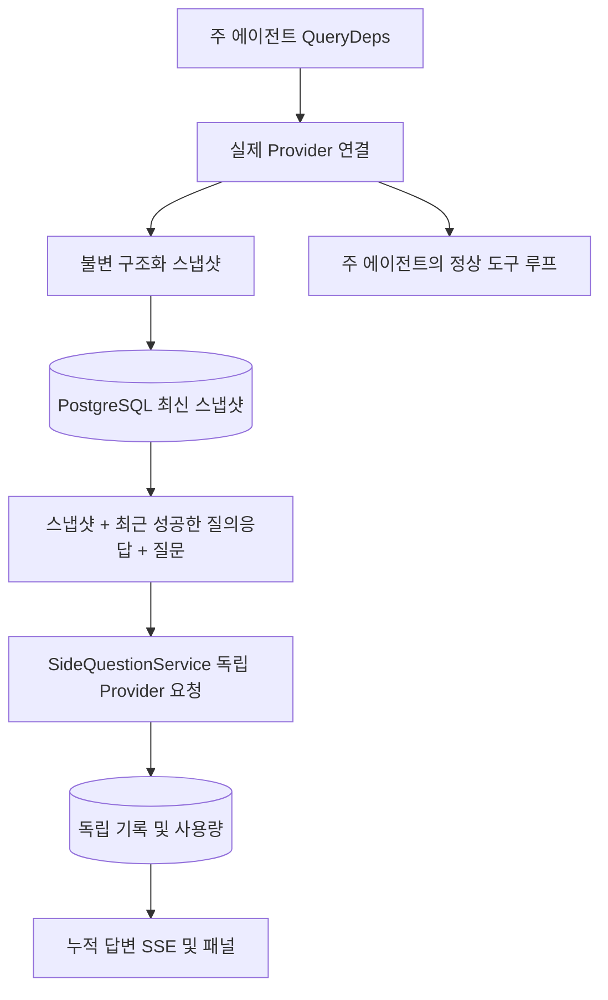

# ARTEX `/btw`

일반 대화, 작업의 MainAgent 및 현재 작업 소속 Worker에서 독립적인 별도 질문을 지원합니다. 주 입력창에 `/btw 질문`을 입력하면 제출하며, 빈 `/btw` 또는 「별도 질문」 버튼으로 기록을 엽니다. 데스크톱에서는 너비 조절 가능한 사이드바, 모바일에서는 Drawer를 사용합니다.

질문 제출 시점의 에이전트 컨텍스트 스냅샷으로 답변하며 스트리밍, 후속 질문, 중지 및 기록 비우기를 지원합니다. 패널 닫기, 페이지 새로 고침 또는 SSE 연결 해제는 모델 요청을 취소하지 않습니다. 중지는 해당 별도 질문에만 영향을 줍니다. 기록 비우기는 요청을 취소하고 별도 질문 기록을 삭제하지만 주 컨텍스트 스냅샷은 유지합니다.

## 구현 범위

기존 Go, norma v0.3.7, Next.js 및 Markdown / ResizablePanel / Drawer / AlertDialog 컴포넌트를 사용합니다. norma 소스를 수정하거나 새 의존성을 추가하지 않습니다. Planner, 다른 작업에서 상속한 Worker 및 도구형 하위 작업 확장은 범위에 포함하지 않습니다.

- `capture.go`는 `Options.Deps.CallModel / CallModelSync`에서만 주 루프 요청을 표시합니다. Provider 데코레이터는 라우팅 풀의 선택 이후 구체적인 모델 내부에 있어 실제 선택된 모델을 기록합니다. 압축·요약 요청은 스냅샷을 덮어쓰지 않습니다.
- 요청 시작, 완전한 모델 응답 및 실행 종료 시 스냅샷을 게시합니다. 생성 중인 불완전한 답변은 게시하지 않습니다. norma의 `MessagesForAPI`로 도구 호출과 결과의 짝을 유지하며 결과는 다음 주 모델 요청 또는 실행 종료 시 스냅샷에 포함됩니다. 스트리밍 중단 시 마지막 유효 경계를 유지합니다.
- JSON 깊은 복사로 구조화 메시지, 시스템 프롬프트, 도구 정의 및 생성 매개변수를 보존합니다. 모델 추론 동안 스냅샷 잠금이나 DB 트랜잭션을 유지하지 않습니다.
- `SideQuestionService`는 구체적인 Provider를 호출합니다. 필요하면 먼저 요약하고, 최종 답변은 첫 컨텍스트 초과 시 텍스트·도구 호출을 아직 출력하지 않았을 때만 축소 후 한 번 재시도합니다. 에이전트 세션을 만들거나 도구 실행기, 주 transcript, 활동 피드, 작업 그래프 또는 작업 모델 전환 체인에 연결하지 않습니다. 기존 구조화 도구 컨텍스트와의 호환성을 위해 답변 요청에는 도구 정의를 유지하지만 요약 요청에는 도구를 제공하지 않습니다. 새로 반환된 도구 호출을 실행할 경로는 없습니다.
- 부모 세션당 실행 요청 하나, 서비스 프로세스당 최대 네 개이며 단일 요청 시간 제한은 120초입니다. 서비스 수명 주기 아래의 독립 취소 컨텍스트를 사용합니다.
- 모델 설정 참조와 비민감 식별 요약을 보존하며 요청 시 기존 설정에서 인증 정보를 가져옵니다. 설정이 삭제되거나 모델·프로토콜·주소 등 식별 필드가 바뀌면 주 에이전트를 먼저 실행하여 스냅샷을 갱신해야 합니다. 테스트는 제품 기본 모델을 변경하지 않습니다.

## 영구 저장 및 복구

`db/schema.sql`이 `side_question_sessions`와 `side_question_requests`를 자동 생성합니다. 전자는 부모 리소스, 최신 스냅샷, 실행 번호, 버전 및 정리 버전을 저장합니다. 후자는 질문, 누적 답변, 상태, 모델, 스냅샷 시각, 사용량, 이벤트 순번 및 페이지 순번을 저장합니다.

부모 세션 키는 conversation ID 또는 task ID + exploration ID + intent ID입니다. Worker는 재사용 가능한 실행 슬롯 이름을 사용하지 않습니다.

부모 세션별 스냅샷 쓰기를 병합하여 250ms마다 저장하고 DB에서 `(run_id, version)`을 비교하여 이전 버전의 덮어쓰기를 막습니다. 질문 제출 전 선택한 스냅샷을 다시 저장합니다. 성공하면 메모리의 큰 스냅샷을 해제하고 실패하면 대기 버전을 유지합니다. 누적 답변은 스트리밍 이벤트 발생 시 최대 250ms마다 저장하며 종료 상태는 즉시 저장하고 DB 오류에 한해 제한적으로 재시도합니다.

서비스 시작 시 남은 `running` 요청을 `interrupted`로 바꾸고 저장된 부분 답변과 사용량을 유지합니다. 요청을 자동 재실행하지 않습니다. 마지막으로 저장한 컨텍스트로 다음 질문을 할 수 있습니다. 스냅샷이 없는 이전 세션은 주 에이전트를 먼저 실행해야 하며 UI 활동 기록으로 컨텍스트를 재구성하지 않습니다.

기록 비우기는 정리 버전을 증가시키고 요청을 삭제합니다. 조건부 갱신으로 늦은 콜백의 재기록을 막습니다. 부모 리소스의 물리 삭제는 외래 키 연쇄 삭제를 사용합니다. Worker 논리 삭제는 같은 트랜잭션에서 별도 질문 데이터를 삭제하고 이후 늦은 스냅샷을 거부합니다. 작업 보관은 새 요청 차단 → 주 흐름 종료 대기 → 별도 질문 취소 및 저장 대기 순서입니다. 보관 형식은 v3이며 별도 질문 테이블이 없는 v1/v2와도 호환됩니다.

전체 기록을 보존하고 순번 커서로 페이지당 최대 20개를 반환합니다. 모델 요청은 최근 성공한 최대 20개 질의응답 원문을 토큰 예산 안에서 재생하며 이전 내용은 독립적인 누적 요약으로 관리합니다. 주 컨텍스트가 예산을 넘으면 별도 질문용 사본의 오래된 부분만 요약하고 최근 도구 호출·결과의 구조는 유지합니다. 요약, 준비 상태 및 사용량도 동일한 동시 실행·취소·120초 제한에 포함합니다. [컨텍스트 예산 및 오픈 소스 참고](CONTEXT_BUDGET.md)를 참조하세요.

## HTTP 계약

다음 경로를 `{parent}`로 사용하며 기존 인증과 리소스 검증을 유지합니다.

- `/api/conversations/{id}`
- `/api/tasks/{id}/chat`
- `/api/tasks/{id}/intents/{iid}`

| 요청 | 반환 및 동작 |
| --- | --- |
| `GET {parent}/side-questions?before={ordinal}` | 최신순 `items`, 독립 실행 상태 `current`, 스냅샷 정보 `snapshot`, `next_cursor`. 커서 0은 최신 페이지 또는 다음 페이지 없음을 뜻함 |
| `POST {parent}/side-questions` | JSON `{ "question": "…", "client_request_id": "UUID" }`. 새 요청은 202와 요청 객체, 동일 ID·질문은 기존 객체와 200 |
| `DELETE {parent}/side-questions` | 현재 부모 세션의 별도 질문 취소 및 삭제 |
| `GET /api/side-questions/{requestID}/events` | `snapshot` SSE 이벤트. `id`는 증가 순번, `data`는 전체 누적 요청 객체. 비우면 `cleared` 전송 |
| `POST /api/side-questions/{requestID}/cancel` | 명시적 취소. 최종 상태는 기록 또는 SSE에서 조회 |

질문은 최대 4000자입니다. 스냅샷 없음, 모델 설정 변경, 같은 부모 세션 사용 중 또는 멱등 ID 충돌은 409, 전역 동시 실행 초과는 429를 반환합니다. SSE 연결마다 누적 상태를 먼저 보내므로 이전 텍스트 조각의 수신 여부에 의존하지 않습니다. 프런트엔드는 요청 ID와 순번으로 병합하며 부모 세션 전환·기록 비우기 시 이전 콜백을 폐기합니다.

## 검증 및 참고

자동 검사, 실제 모델 사용 및 알려진 제한은 [VALIDATION.md](VALIDATION.md)에 기록되어 있습니다.

독립 요청은 [Grok CLI side-question.ts의 고정 커밋](https://github.com/superagent-ai/grok-cli/blob/fb97af83f06dca873281d60168430f06c8de6324/src/utils/side-question.ts), 실행 격리는 [OpenCode의 고정 커밋](https://github.com/anomalyco/opencode/tree/b3f1a96c6dd7adeb28b36dd11add1998fc84d67b)을 참고했습니다. ARTEX는 프런트엔드 로그를 이어 붙이지 않고 norma의 구조화 메시지를 컨텍스트로 사용합니다.
