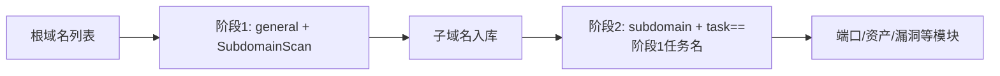

---

## name: scopesentry-mcp
description: ScopeSentry MCP로 보안 스캔 플랫폼(프로젝트, 작업, 템플릿, 자산, 노드)을 관리합니다. 사용자가 ScopeSentry, MCP, API Key, 스캔 작업, 자산 조회를 언급할 때 사용합니다.

# ScopeSentry MCP 사용 안내

**ScopeSentry 인스턴스가 배포된** 사용자를 위한 안내입니다. Cursor 또는 다른 MCP 클라이언트로 플랫폼에 연결하며 로컬 소스 코드는 필요하지 않습니다.

## 1. 준비

### 1.1 서비스 접근 확인

- 기본 웹 화면: `http://<호스트>`
- MCP 엔드포인트: `http://<호스트>/mcp`(리버스 프록시나 프런트엔드 프록시가 있다면 실제 `/mcp` 주소 사용)

### 1.2 API Key 생성

1. 브라우저에서 ScopeSentry 웹 화면에 로그인합니다.
2. **API Key** 관리 페이지에서 키를 만듭니다(또는 관리자가 제공한 인터페이스 사용).
3. 반환된 `ssk_...` 문자열을 저장합니다(**한 번만 표시됨**).

### 1.3 Cursor MCP 설정

Cursor → Settings → MCP → 서버 추가:

```json
{
  "mcpServers": {
    "scopesentry": {
      "url": "http://<你的主机>:8082/mcp",
      "headers": {
        "X-API-Key": "ssk_你的密钥"
      }
    }
  }
}
```

`Authorization: Bearer ssk_여기에_키_입력`도 사용할 수 있습니다.

설정 후 MCP를 재시작하거나 Cursor를 다시 로드하고 도구 목록에 `list_projects`, `list_assets` 등이 표시되는지 확인합니다.

---

## 2. 도구 목록


| 도구 | 용도 |
| ---------------------- | ----------------- |
| `list_projects` | 태그별 프로젝트 트리(프로젝트 ID 포함) |
| `list_projects_data` | 페이지별 프로젝트 목록, 이름 검색 가능 |
| `get_project` | 프로젝트 상세 |
| `create_project` | 프로젝트 생성 |
| `list_tasks` | 스캔 작업 목록 |
| `get_task` | 작업 상세 |
| `list_scan_templates` | 스캔 템플릿 목록 |
| `get_scan_template` | 템플릿 상세 |
| `list_plugin_modules` | 스캔 파이프라인 모듈 이름 |
| `list_plugins` | 사용 가능한 플러그인(hash, 기본 매개변수 포함) |
| `create_scan_template` | 스캔 템플릿 생성 |
| `create_scan_task` | 스캔 작업 생성 |
| `list_assets` | 유형별 자산 조회(페이지별 목록) |
| `count_assets` | 자산 수 집계(`/api/assets/common/total`) |
| `get_asset_detail` | 자산 또는 취약점 상세 |
| `add_asset_tag` | 자산에 태그 추가 |
| `list_nodes` | 스캔 노드 목록 |


도구별 매개변수는 MCP 도구 설명(schema)을 기준으로 합니다. `list_assets` / `count_assets`의 search, filter 구문은 같으며 자산 조회 전에 `list_assets` description을 읽어 볼 수 있습니다.

전체 개수가 필요하면 `count_assets`를 사용합니다(웹 페이지 구분의 총 개수 인터페이스). 개수만 세려고 `list_assets`의 모든 페이지를 반복 조회할 필요가 없습니다.

---

## 3. 자주 사용하는 작업 흐름

### 3.1 프로젝트별 자산 조회

사용자나 컨텍스트에 **프로젝트 조건이 이미 있으면** 우선 `filter.project`로 범위를 좁혀 여러 프로젝트의 과도한 데이터로 응답이 느려지는 것을 피합니다. 프로젝트가 명확하지 않으면 필터를 반드시 넣을 필요는 없습니다.

1. `list_projects` 또는 `list_projects_data`로 대상 프로젝트의 **ObjectID**를 얻습니다(`id` / `children[].value`).
2. `list_assets`에 `filter.project`를 전달합니다(**프로젝트 이름이 아닌 ID 필수**).

```json
{
  "asset_type": "asset",
  "pageIndex": 1,
  "pageSize": 20,
  "search": "domain=^example.com",
  "filter": {
    "project": ["<项目ObjectID>"]
  }
}
```

### 3.2 스캔 작업 생성

1. `list_nodes`로 온라인 노드 이름을 얻습니다.
2. `list_scan_templates` 또는 `create_scan_template`로 템플릿 **ObjectID**를 얻습니다.
3. `create_scan_task`: `name`, `node`는 필수이며 `template`에는 이름이 아닌 템플릿 ID를 넣습니다.

**대상 소스 `targetSource`(웹과 동일):**

| targetSource | 설명 | 필수 매개변수 |
| --- | --- | --- |
| `general` | 대상 직접 입력 | `target` |
| `project` | 프로젝트에서 대상 읽기 | `project`(프로젝트 ObjectID 배열) |
| `asset` | 웹 자산 저장소 검색 | `search`, 선택 사항: `project`, `filter`, `targetNumber` |
| `RootDomain` | 루트 도메인 저장소 검색 | `search`, 선택 사항: `project`, `filter`, `targetNumber` |
| `subdomain` | 하위 도메인 저장소 검색 | `search`, 선택 사항: `project`, `filter`, `targetNumber` |
| `UrlScan` | URL 스캔 결과 검색 | `search`, 선택 사항: `project`, `filter`, `targetNumber` |
| `*Source`(예: `subdomainSource`) | 자산 페이지의 선택/검색 결과에서 생성 | `targetTp=search`이면 `search`, `targetTp=select`이면 `targetIds` |

**예제: 루트 도메인 직접 스캔**

```json
{
  "name": "example-子域名收集",
  "node": ["node-1"],
  "template": "<模板ObjectID>",
  "targetSource": "general",
  "target": "example.com\nfoo.com",
  "project": ["<项目ObjectID>"]
}
```

**예제: 하위 도메인 저장소에서 후속 스캔(이전 작업 이름으로 필터)**

```json
{
  "name": "example-端口与漏洞",
  "node": ["node-1"],
  "template": "<后续模块模板ObjectID>",
  "targetSource": "subdomain",
  "search": "task==\"example-子域名收集\"",
  "project": ["<项目ObjectID>"]
}
```

### 3.3 루트 도메인 전체 정보 수집(두 단계 권장)

입력이 **루트 도메인**이고 **전체 정보 수집**이 목적이면 모든 파이프라인을 한 번에 실행하지 말고 두 번에 나누어 스캔하는 것이 좋습니다.

**이유:** 분산 작업은 **개별 대상** 단위로 배분됩니다. 루트 도메인을 받은 노드는 그 도메인에서 발견한 하위 도메인의 후속 모듈도 계속 실행하므로 부하 불균형, 속도 저하, 오류가 생기기 쉽습니다.

**권장 방식:**

1. **1단계: 하위 도메인 수집만 수행**
   - `targetSource`: `general`
   - `target`: 모든 루트 도메인(여러 줄)
   - 템플릿: `SubdomainScan`, `SubdomainSecurity`만 활성화(하위 도메인 스캔 + 하위 도메인 탈취 검사)
   - `get_task` 등으로 작업 완료 대기

2. **2단계: 후속 모듈 실행**
   - `targetSource`: `subdomain`
   - `search`: `task=="<1단계 작업 이름>"`(작업 이름 정확 일치)
   - 필요시 `project`로 범위 축소
   - 템플릿: 포트 스캔, 자산 매핑, 취약점 스캔 등(SubdomainScan 제외 가능)
   - 하위 도메인을 독립 대상으로 각 노드에 배분하므로 병렬 효율 향상

웹의 하위 도메인 자산 페이지에서 작업 이름으로 필터링한 뒤 ‘하위 도메인에서 작업 생성’을 사용해도 같습니다.



### 3.4 스캔 템플릿 생성

1. `list_plugin_modules` → 모듈 이름 목록
2. `list_plugins`(`module` 필터 가능) → 플러그인별 `hash`와 기본 `parameter`
3. `create_scan_template`: `modules`로 ‘모듈 → 플러그인 hash 배열’ 지정

---

## 4. 자산 조회(`list_assets` / `count_assets`)

`count_assets`와 `list_assets`는 같은 `asset_type`, `search`, `filter`를 사용합니다. `count_assets`는 `{ "total": N }`을 반환하며 웹의 `/api/assets/common/total`에 대응합니다.

```json
{
  "asset_type": "subdomain",
  "search": "task==\"某任务名\"",
  "filter": {"project": ["<项目ObjectID>"]}
}
```

**성능 권장 사항(두 도구 공통):** 프로젝트 조건이 있으면 우선 `filter.project`로 범위를 좁히세요. `search`의 인덱스 필드는 가능하면 `==` 정확 일치나 `^` 접두사 일치를 사용하고([4.3](#43-search-검색-표현식) 참조), 광범위한 `=` 부분 일치로 응답이 느려지는 것을 피하세요. 프로젝트 정보가 없으면 필터를 강제하지 않습니다.

`filter.project` 지원 유형은 [4.4](#44-filter-정확-필터) 표를 참조하세요.

### 4.1 자산 유형 `asset_type`

`asset`、`RootDomain`、`subdomain`、`app`、`mp`、`UrlScan`、`SensitiveResult`、`DirScanResult`、`crawler`、`vulnerability`、`PageMonitoring`、`IPAsset`、`SubdomainTakerResult`

별칭 예: `web`→asset, `vuln`→vulnerability, `ip`→IPAsset, `url`→UrlScan

### 4.2 매개변수 설명


| 매개변수 | 설명 |
| ------------------------ | --------------------------------------- |
| `pageIndex` / `pageSize` | 페이지 구분, 기본값 1 / 20 |
| `search` | 검색 표현식(다음 절 참조) |
| `filter` | 정확 필터 JSON(다음 절 참조) |
| `sort` | UrlScan, DirScanResult만 `length` 정렬 지원 |
| `sid` | SensitiveResult 전용: 민감 정보 규칙 이름 |


`search`와 `filter`는 **함께 사용할 수 있습니다**.

### 4.3 search 검색 표현식

사용자 정의 DSL이며 **SQL이 아닙니다**.


| 연산자 | 의미 | 인덱스 | 예제 |
| ---- | ---- | ---- | --------------------------- |
| `=` | 부분 일치(regex) | 사용 안 함 | `domain=example` |
| `==` | 정확 일치 | **사용** | `port==443` |
| `!=` | 제외 | — | `port!="80"` |
| `&&` | AND | — | `domain==example.com && port==443` |
| `||` | OR | — | `title=admin || body=login` |


**인덱스와 연산자:** `domain`, `ip`, `port`, `title` 등에는 인덱스가 있지만 **`==` 정확 일치** 또는 **값이 `^`로 시작하는 접두사 일치**(예: `domain=^example.com`)만 인덱스를 사용합니다. **`=`는 regex 부분 일치로 변환되어 인덱스를 사용할 수 없으므로** 데이터가 많으면 느려질 수 있습니다.

**모든 유형의 공통 search 필드:** `tag`, `task`(작업 이름), `rootDomain`

**project를 search에 넣으면 안 됩니다**(무효이거나 `&&`와 조합 시 오류). 프로젝트 필터에는 `filter.project`를 사용하세요.

**유형별 주요 search 필드:**


| asset_type | 필드 |
| -------------------- | ----------------------------------------------------------------------------------- |
| asset                | domain, ip, port, service, app, title, statuscode, icon, banner, type, body, header |
| RootDomain           | domain, icp, company                                                                |
| subdomain            | domain, ip, type, value                                                             |
| app                  | name, icp, company, category, description, url, apk                                 |
| mp                   | name, icp, company, category, description, url                                      |
| UrlScan              | url, input, source, resultId, type                                                  |
| SensitiveResult      | url, sname, body, info, md5                                                         |
| DirScanResult        | url, statuscode, redirect, length                                                   |
| vulnerability        | url, vulname, matched, request, response, level                                     |
| crawler              | url, method, body, resultId                                                         |
| PageMonitoring       | url, hash, diff, response                                                           |
| IPAsset              | ip, domain, port, service, webServer, app                                           |
| SubdomainTakerResult | domain, value, type, response                                                       |


**search 예제:**

- `domain==www.example.com && port==443`(정확 일치, 인덱스 사용)
- `domain=^example.com`(접두사 일치, 인덱스 사용)
- `ip==192.168.1.1`
- `task=="작업 이름"`
- `level==high`(vulnerability)
- `statuscode==200`(DirScanResult)

포함 검색이 필요할 때만 `=`를 사용합니다. 예: `title=admin`(인덱스를 사용하지 않으므로 프로젝트 등의 조건으로 범위를 좁히는 것이 좋음).

### 4.4 filter 정확 필터

JSON 객체에서 같은 키의 여러 값은 **OR**, 서로 다른 키는 **AND**입니다.

**프로젝트 조건이 있으면 `project` 우선:** 사용자나 컨텍스트에서 프로젝트가 명확하고 asset_type이 `project`를 지원하면 범위를 좁히기 위해 추가합니다. 프로젝트 정보가 없으면 필수가 아닙니다.


| filter key | 의미 | 값 설명 |
| ------------ | -------- | -------------------------------------------------------- |
| `project` | 소속 프로젝트 | **ObjectID**, `list_projects` / `list_projects_data`로 조회 |
| `task` | 원본 작업 | **작업 이름**, `list_tasks`의 `name` |
| `port` | 포트 | 예: `"443"` |
| `service` | 서비스/프로토콜 | 예: `"https"` |
| `app` | 애플리케이션 지문 | 예: `"Nginx"` |
| `icon` | 아이콘 hash | |
| `statuscode` | HTTP 상태 코드 | 주로 asset에서 사용 |
| `status` | 상태 | UrlScan/DirScan HTTP 코드, 취약점/민감 정보 처리 상태 |
| `level` | 취약점 등급 | critical / high / medium / low / info |
| `type` | 유형 | 예: 하위 도메인 레코드 유형 A, CNAME |
| `color` | 민감 정보 규칙 색상 | SensitiveResult |
| `sname` | 민감 정보 규칙 이름 | SensitiveResult |
| `tags` | 태그 | |


**유형별 지원 filter key:**


| asset_type                            | filter key                                                      |
| ------------------------------------- | --------------------------------------------------------------- |
| asset                                 | project, port, service, app, icon, statuscode, type, task, tags |
| RootDomain                            | project, tags                                                   |
| subdomain                             | project, type, task, tags                                       |
| app / mp                              | project, tags                                                   |
| UrlScan                               | status, tags                                                    |
| DirScanResult                         | status, tags                                                    |
| SensitiveResult                       | status, color, sname, tags                                      |
| crawler                               | project, task, tags                                             |
| vulnerability                         | project, level, status, task, tags                              |
| PageMonitoring / SubdomainTakerResult | tags                                                            |
| IPAsset                               | project, port, service, app                                     |


**filter 예제:**

```json
{"project": ["<项目ObjectID>"], "port": ["443"]}
```

**조합 조회 예제:**

```json
{
  "asset_type": "asset",
  "search": "domain=^baidu && port==443",
  "filter": {"project": ["<项目ObjectID>"]},
  "pageIndex": 1,
  "pageSize": 10
}
```

**주의:**

- 프로젝트 조건이 있으면 지원되는 유형에서 우선 `filter.project`를 추가합니다. 프로젝트 컨텍스트가 없으면 필수가 아닙니다.
- `filter.project`에 프로젝트 표시 이름을 넣지 마세요.
- 알려진 값은 `==`, 접두사는 `^`를 사용하세요. 대형 테이블에서 `=` 부분 일치를 남용하지 마세요.
- UrlScan HTTP 상태는 `filter.status`를 사용합니다. DirScanResult는 search에 `statuscode==200`을 사용할 수 있습니다.
- SensitiveResult 규칙 이름은 `search`의 `sname=규칙이름` 또는 `filter.sname`을 사용합니다.

### 4.5 sort 정렬

**UrlScan**, **DirScanResult**만 지원합니다.

```json
{"length": "ascending"}
```

다른 유형은 `sort`를 무시하고 기본 시간순으로 정렬합니다.

---

## 5. 스캔 템플릿 모듈 이름

`TargetHandler`、`SubdomainScan`、`SubdomainSecurity`、`PortScanPreparation`、`PortScan`、`PortFingerprint`、`AssetMapping`、`AssetHandle`、`URLScan`、`WebCrawler`、`URLSecurity`、`DirScan`、`VulnerabilityScan`、`PassiveScan`

---

## 6. 문제 해결


| 현상 | 조치 |
| --------- | -------------------------------------------------- |
| MCP 도구가 없음 | URL, API Key, ScopeSentry 실행 여부 확인 |
| 401 / 403 | API Key 재생성 또는 교체 |
| 자산을 찾을 수 없음 | `filter.project`가 ObjectID인지 확인. search에 project를 넣지 않음 |
| 템플릿/작업 생성 실패 | `template`은 템플릿 ObjectID, `node`는 온라인 노드 이름이어야 함 |
| 조회가 느리거나 멈춤 | 프로젝트가 있으면 `filter.project` 추가. search의 인덱스 필드에 `==` 또는 `^` 사용, `=` 사용 최소화, `pageSize` 축소 |


---

